# AWS #
## Assgnment-1 ##
## Task-1 ##

**Create a vpc through wizard, having one public subnet and one private subnet**

**Solution**

To create my new VPC we need to go into **VPC Dashboard** section on this we need to click on **Launch VPC Wizard**.

Select VPC Configuration as **VPC with Public and Private Subnets**

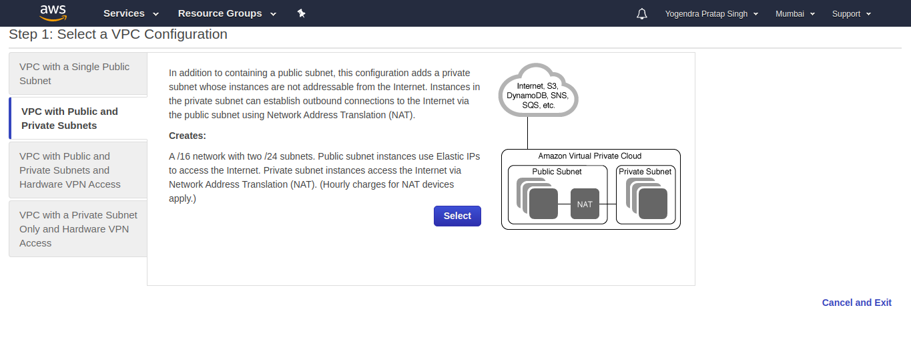

Here is my by default VPC by AWS

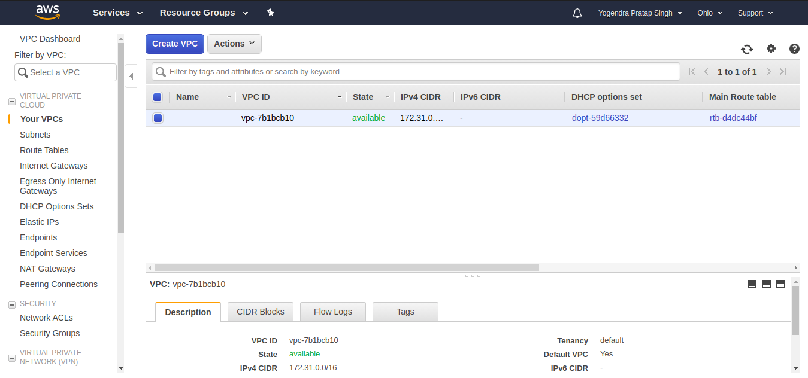

Next we need to configure VPC with respective details
I take IPv4 CIDR block as **10.0.0.0/16** unchecked for IPv6 CIDR block and gives name **vpc-temp** see below for much details 
Here I am not using elastic IP, I'm using NAT for this.

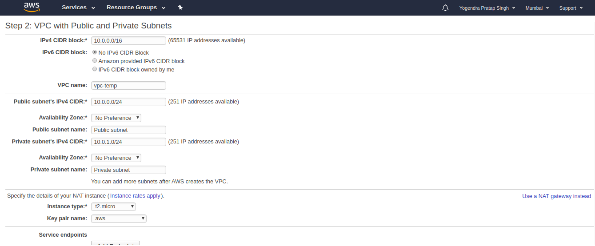

And VPC created Successfully

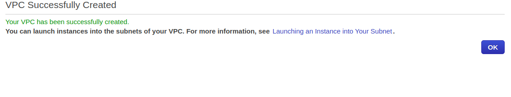

**-------------------------------------------------------------------------------------------------------------------------------------------------**

## Task-2 ##

**Create two instances within the vpc that you created in task 1, windows instance in public subnet and linux instance in private subnet. check if 
linux is pingable from windows and vice versa**

**Solution**

Above I in task-1 we created a VPC on that we also created one Public and one Private Subnet so here I need to use both of them Public Subnet will be allocated to **Windows Server** and Private will **Ubuntu**

Go to the EC2 and click on **Launch Instance**

Searched for **Windows Server**

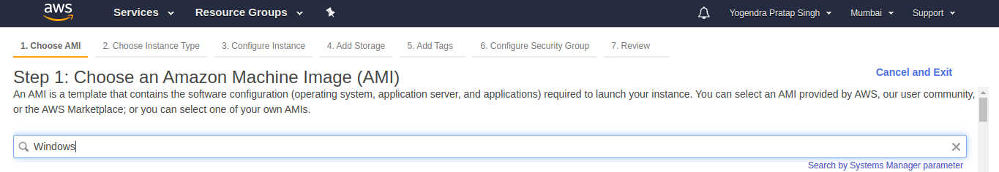

Choosed **t2.micro** instance type

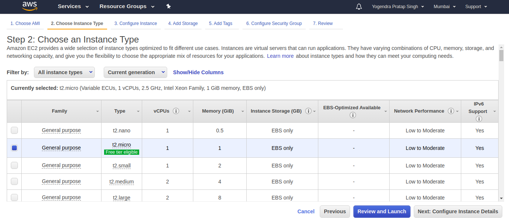

**Now Configuring Instance details**
For this I take Number of Instance as 1 and during Window Server Instance creation we need to take VPC-temp which was I created here I'm not taking default-VPC by aws and take Public Subnet for subnet option and I'm choosing **Enable** for auto assign for public-IP

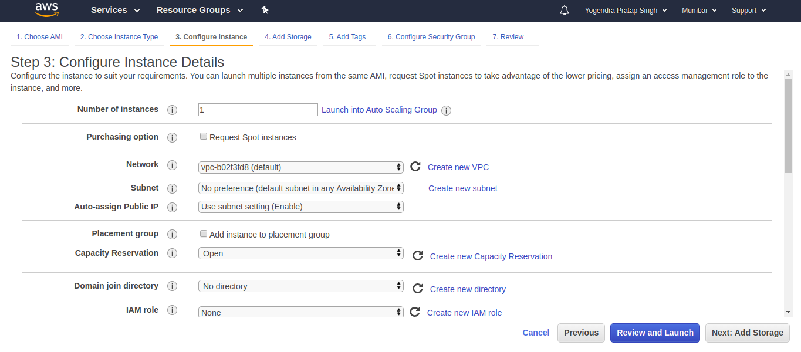

Now Add Storage in my case I make it 30gib

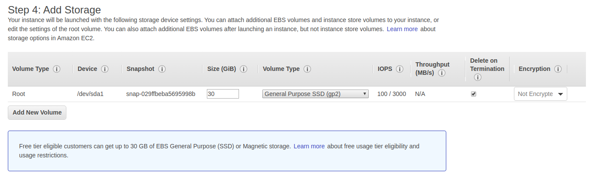

Now Configure Security Group

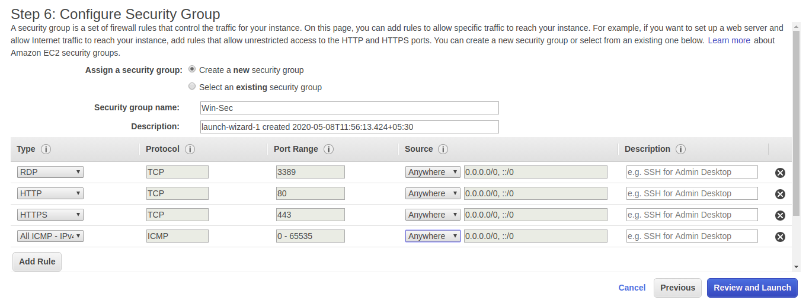

Did Same for Ubuntu Instance which will be use Private Subnet but I need to disable for auto-assign public ip

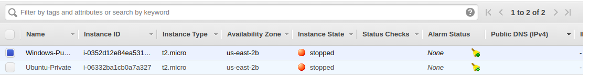

Now I'm rooting to ping both instances from each other

To launch Windows Instance we need to do download **Remote Desktop File** and password will be provided in encrypted form after giving actual path of where my .pem file is

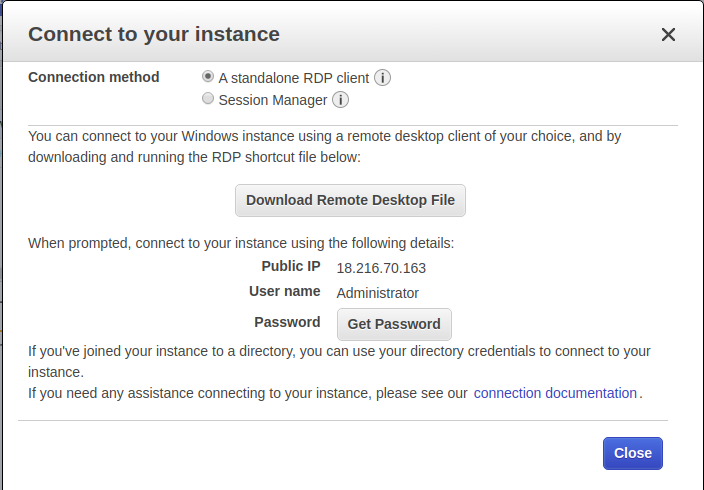

And here our Windows Server is up but we need to enable echo request on Windows Instance to ping successfully

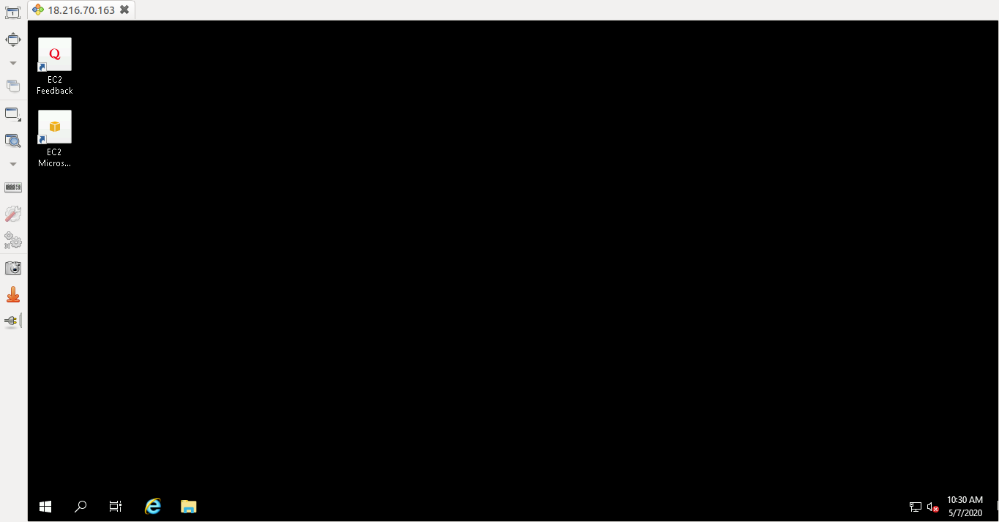

for that I searched for **Firewall** on start and go into **inbound rules** and enable **File and Printer Sharing** option

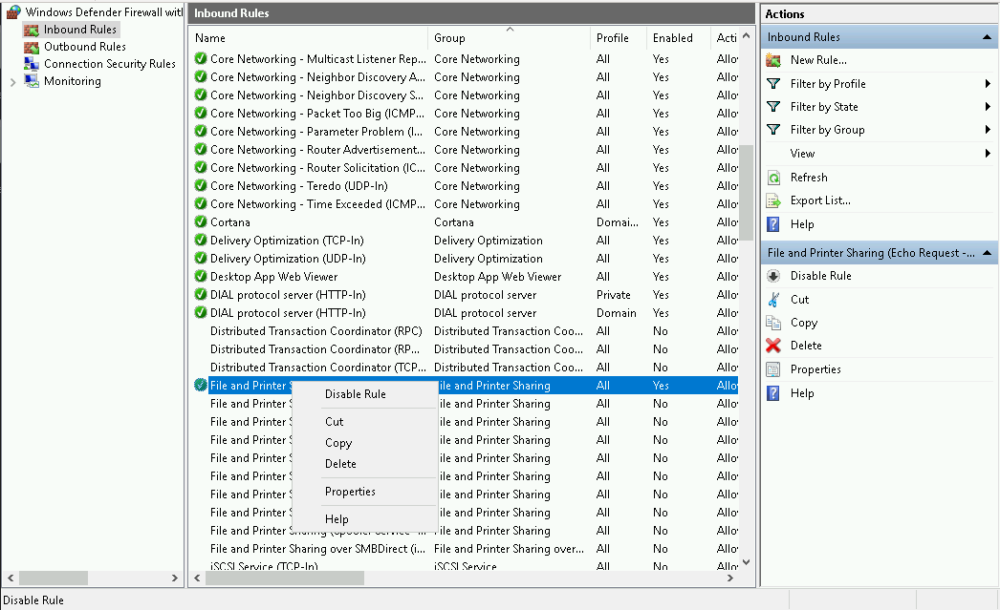

And here I'm Pinging my Linux Instance which is on Private Subnet

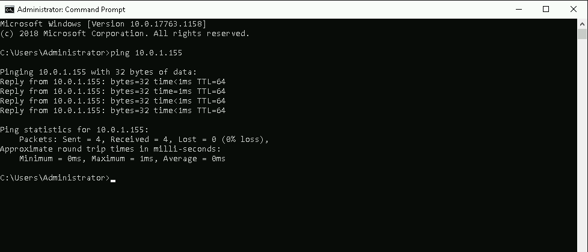

But Unble to ping Private Subnet Instance i.e. Linux

**--------------------------------------------------------------------------------------------------------------------------------------------------**

## Task-3 ##

**Delete all the instances and now make those two instances that you created in previous task using aws-cli**

To create an Windows instance using aws cli I used this command in which we need to specify the instace image id, count value, instance type, your's key name, security group id and Subnet id here I gives Public Subnet id which need in task.

**aws ec2 run-instances --image-id ami-002aa17df8c86f635 --count 1 --instance-type t2.micro --key-name aws --security-group-ids sg-052043812f3944c08 --subnet-id subnet-06d010d5a2b7b4b6e**

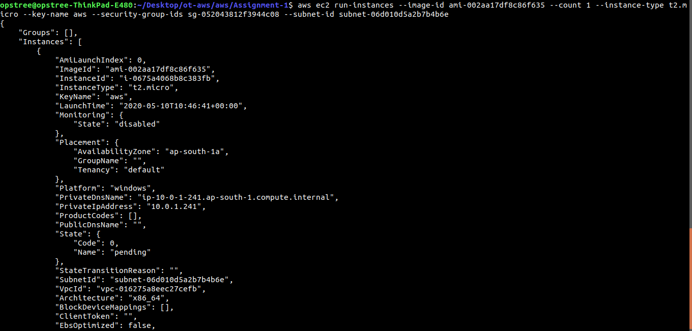

To create an Linux instance using aws cli I used this command in which we need to specify the instace image id, count value, instance type, your's k
ey name, security group id and Subnet id here I gives Private Subnet id which need in task

**aws ec2 run-instances --image-id ami-0b44050b2d893d5f7 --count 1 --instance-type t2.micro --key-name aws --security-group-ids sg-052043812f3944c08 --subnet-id subnet-06d010d5a2b7b4b6e**

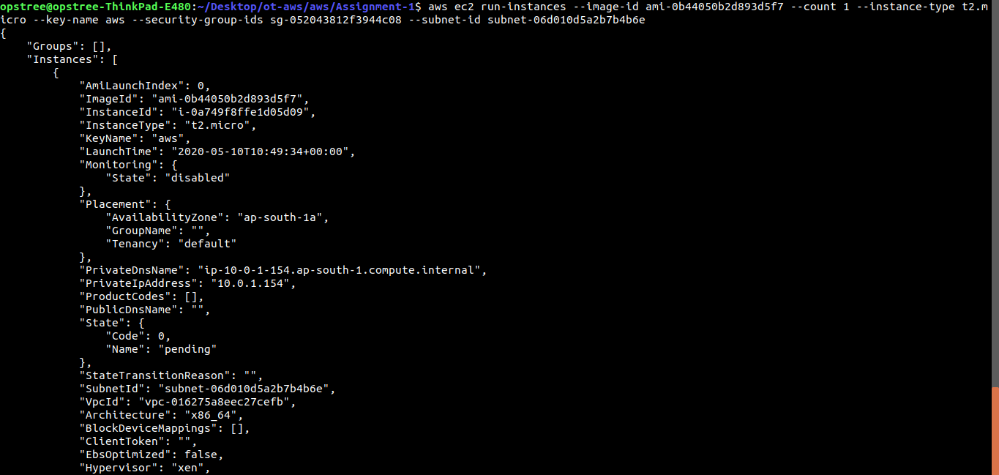

Windows is pinging which is in Public Subnet

But Unble to ping Private Subnet Instance i.e. Linux
