# AWS #
## Assgnment-2 ##
## Task-1 ##

#### Create a vpc not by wizard this time but manually, having 2 public subnets and 2 private subnets and 2 protected subnets.setup should be highly available
- Create 1 IGW and 2 NGW in each availability zone and make the appropriate routes in route tables
- Main route will remain intact, instead make 4 route tables
- Public_route_table
- Private_route_table_1
- Private_route_table_2
- Protected_route_table

First I need to create a VPC which I named **VPC-Mumbai** with CIDR of **10.0.0.0/16**

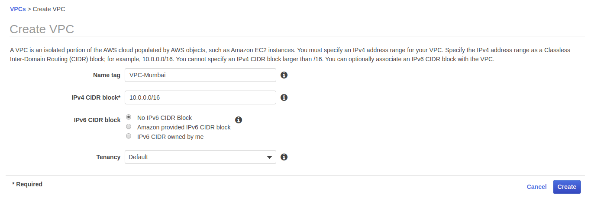

So in first step I created VPC

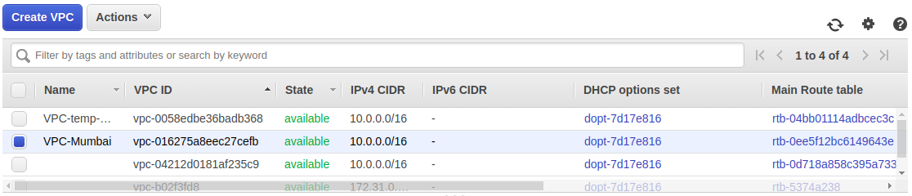

Then as per task requirement we need to create **2 public subnets and 2 private subnets and 2 protected subnets** which I created with different CIDR

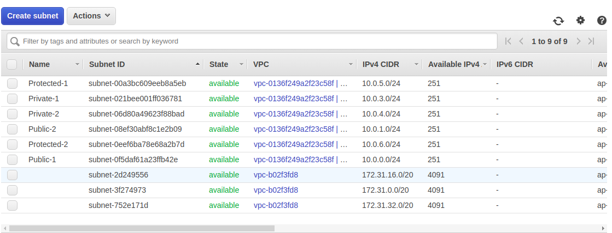

1 IGW and 1 NGW also required which also created after subnets creation

Now time to maintain Route-table
Created Route-Table for Public

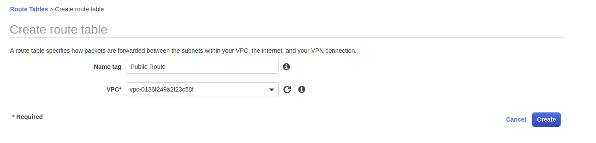

Then firstly mention IGW in Public Route

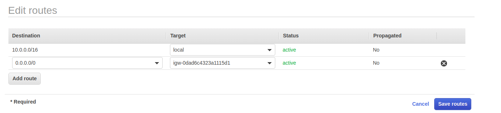

After this I associated Public Subnets into Public Route-Table

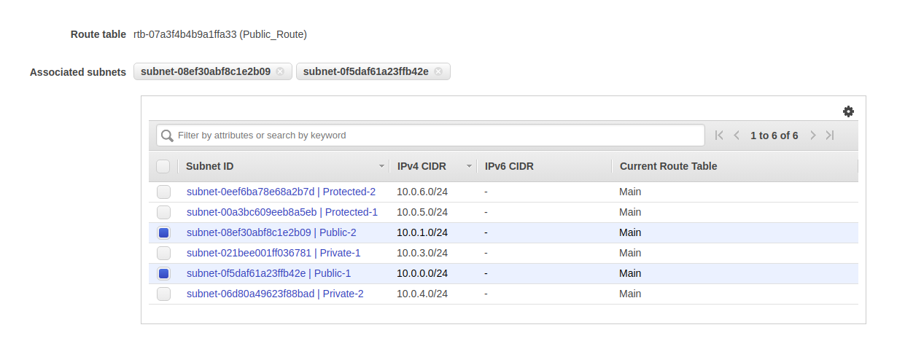

For Private Route-table need to add NGW

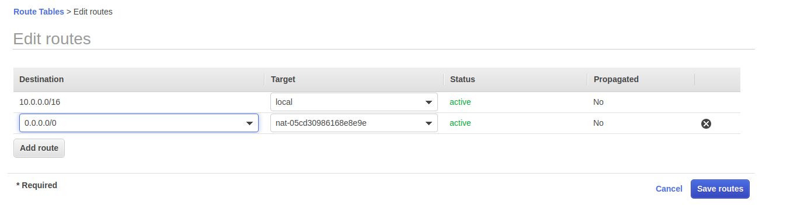

And after this for subnet association did same as public subnet association

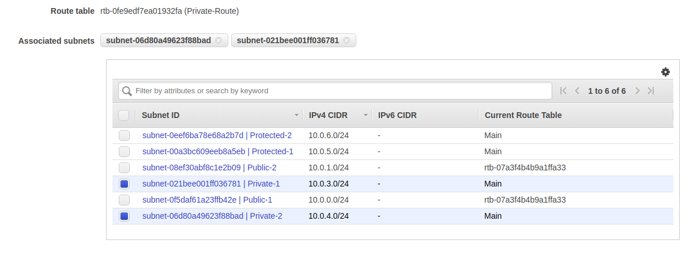

For Protected Subnet need not to add anything

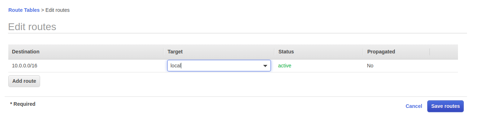

Protected Subnet association done as same as Public and Private Subnet association done

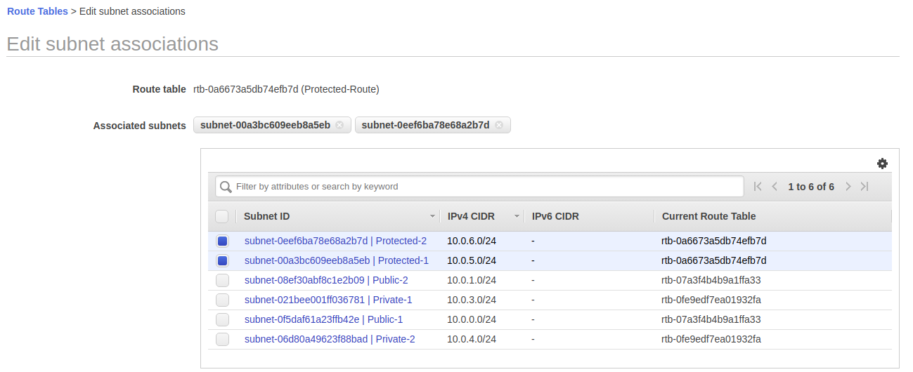

Now it is our final route-table

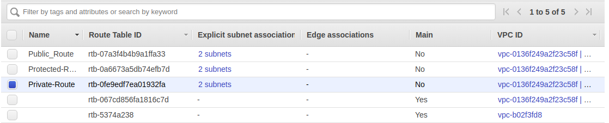

**--------------------------------------------------------------------------------------------------------------------------------------------------**

## Task-2 ##

Make LAMP setup with 2 instances in each private subnets.
Server-1 should serve a webpage that would say "Hi! i am server 1"
Server-2 should serve a webpage that would say "Hi! i am server 2"

SSH to our EC2 instance 

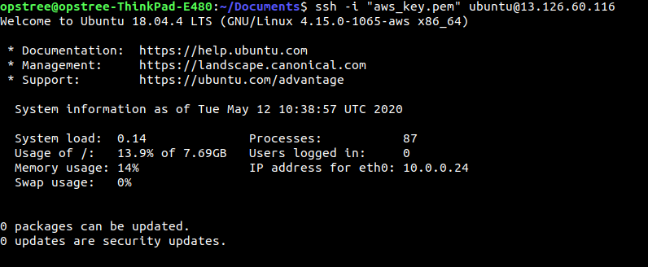

Changed Nginx index.html page

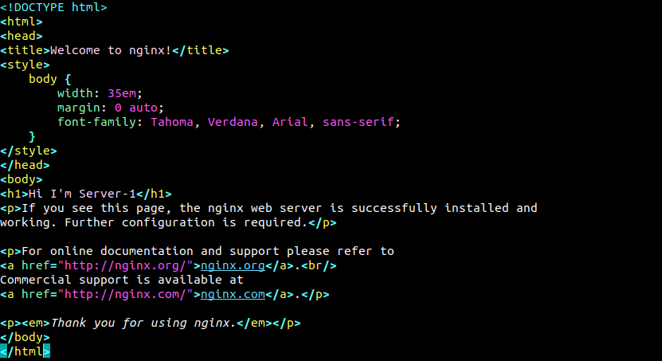

This will done on both Private Instances

**--------------------------------------------------------------------------------------------------------------------------------------------------**

## Task-3 ##
Launch a public load balancer that would forward the requests to these 2 LAMP instances
create the same setup using aws-cli except vpc
**NOTE** Machines in the protected subnets shouldn't be going to internet and vice versa (verify this by launching an instance in this subnet)
Make Documentation and push to the repo
Make sure you copy the actual logs in the documentation.

For this here I'm creating **Network Load Balancer** 

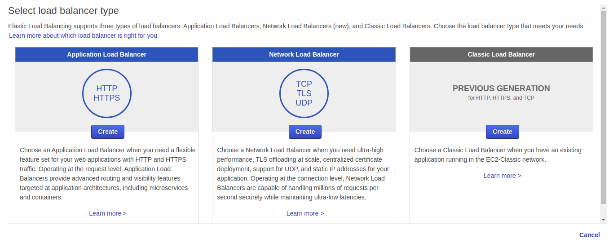

Next Need to configure our Load Balancer

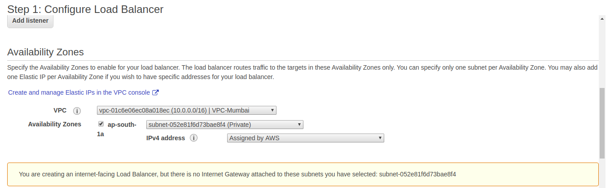

After configuring we need to **Register Targets** here I checked for my both Instances

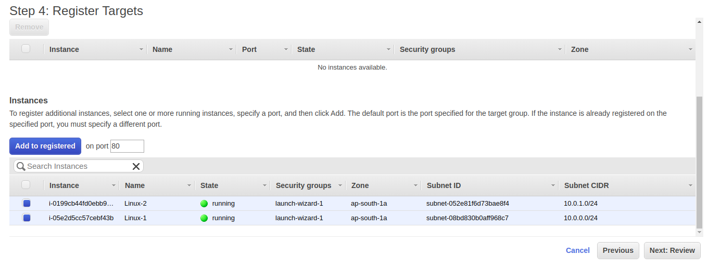

After this Load balancer will be created

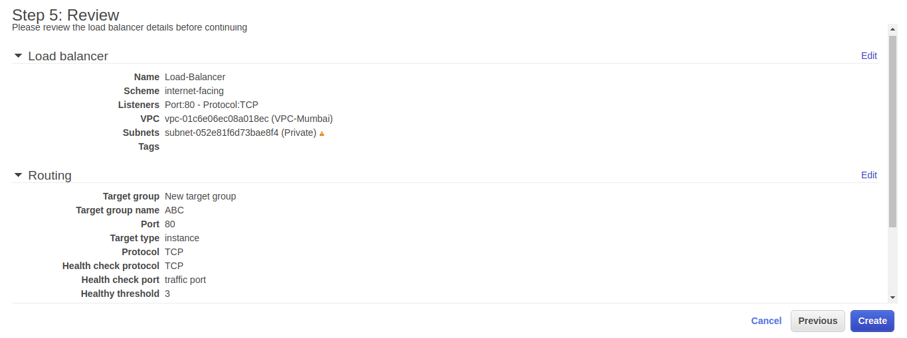

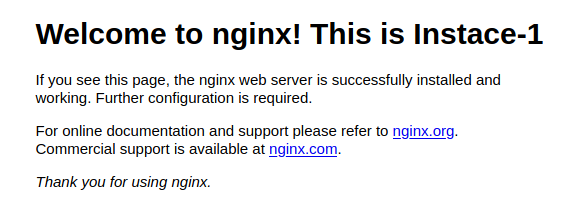

**--------------------------------------------------------------------------------------------------------------------------------------------------**
