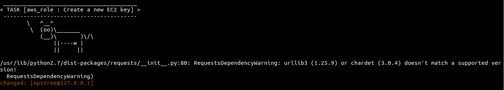
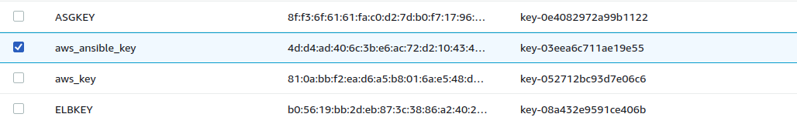
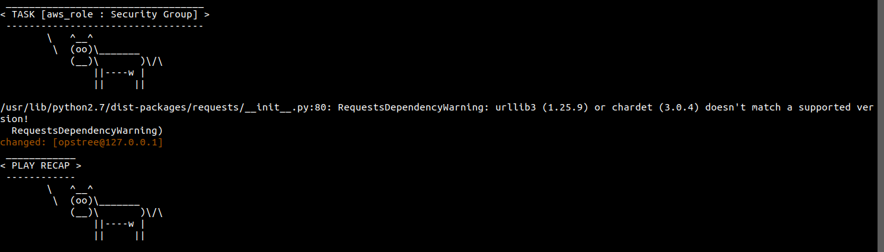
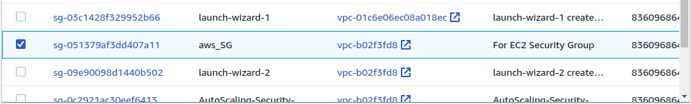
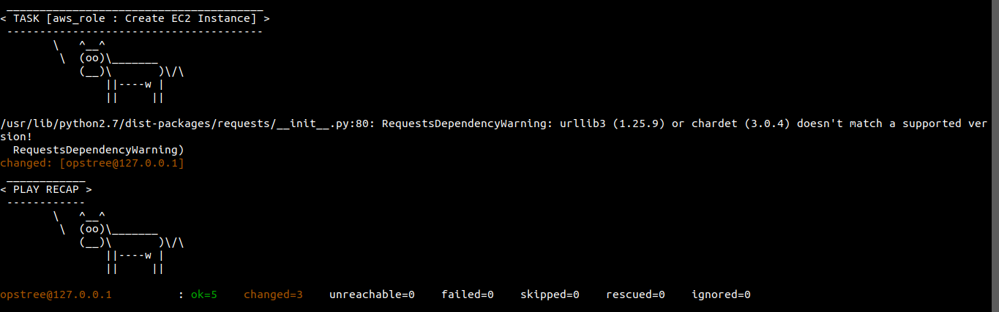
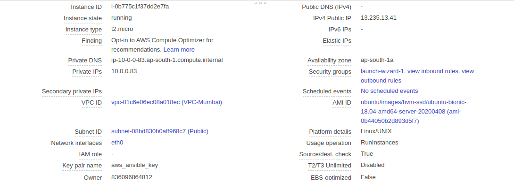

# AWS #
## Assgnment-6 ##
## Task ##

**Launch below infrastructure in your aws account using ansible's aws cloud modules**
*create a key pair using ansible
create one security group that would allow you to ssh into the instance
using the key that you created, launch an instance in default vpc of N.virginia region with tags of your choice*

After execution of **Ansible-Role** I got the result

A New Key-Pair Created

We can see in AWS Console

A New Security Group created named **aws-SG**

We can see this on AWS Console

A New EC2 Instance created named **EC2-Ansible**

We can see this on AWS Console

This is the Description of our **EC2-Ansible** instance

                                                                                               

