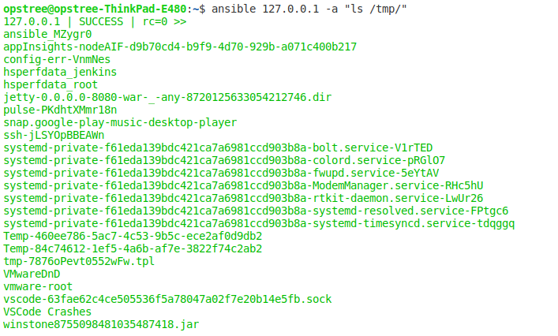
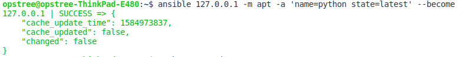
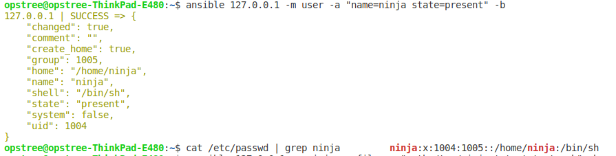
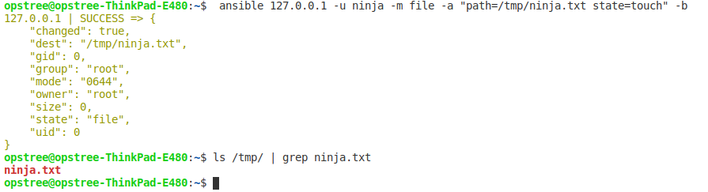
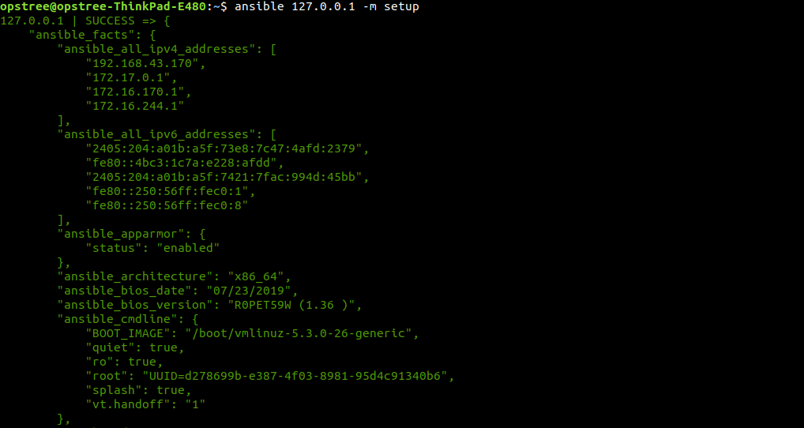
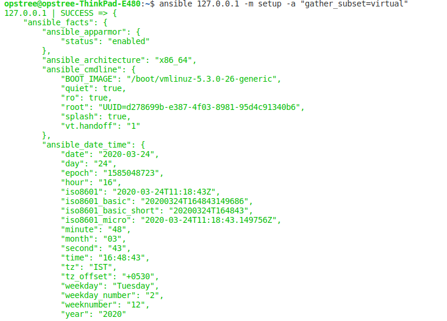
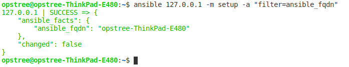

# Ansible Assignment-2 #
## Must Do ##
*  **Use ansible to list out files & folders in /tmp directory**

*  **Install python on target machine using ansible**

*  **Use ansible to Create a user ninja**

*  **Use ansible to create a file /tmp/ninja.txt using ninja user**

*  **Fetch and display to STDOUT Ansible facts using the setup module**

*  **Fetch and display only the "virtual" subset of facts for each host**

*  **Fetch and display the value of fully qualified domain name (FQDN) of each host from their Ansible facts**

