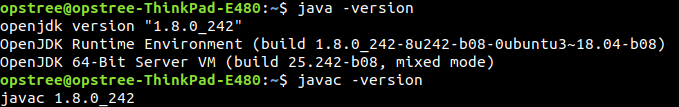
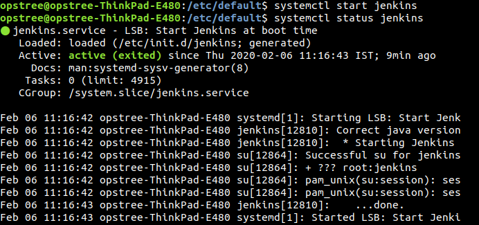
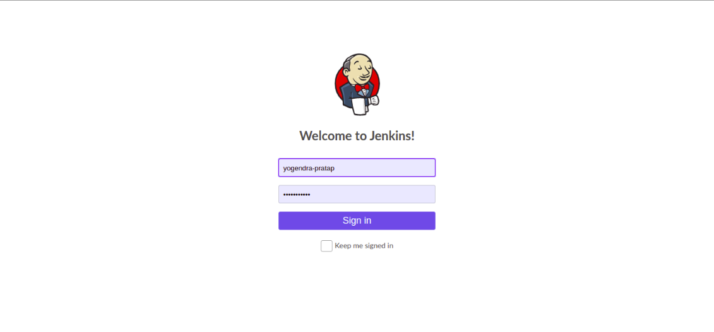
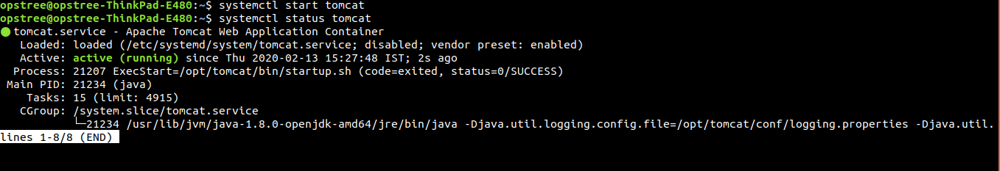
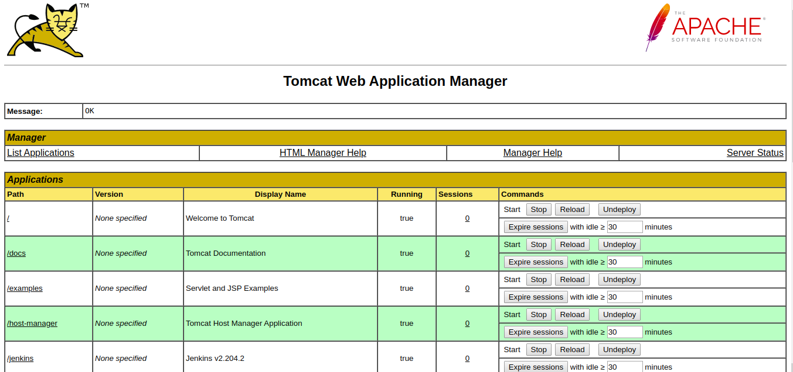
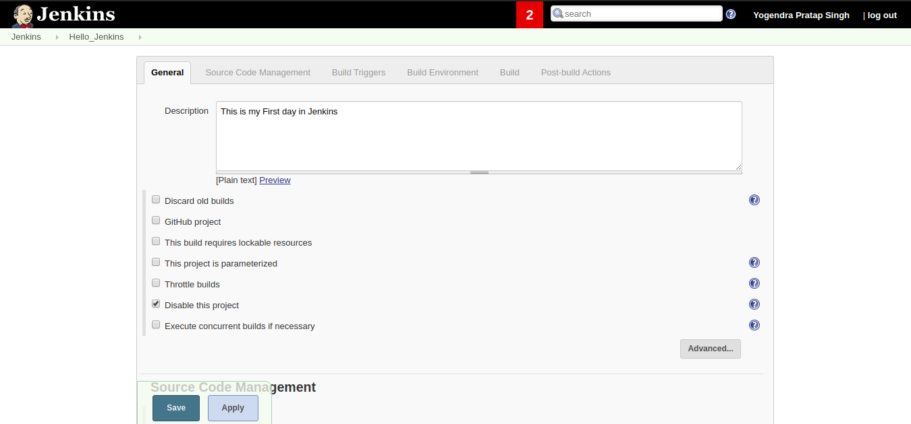

# Jenkins Assignment-1

## Install Jenkins using package. ##
**Before install Jenkins we need to install java on our system because java is dependancy for jenkins.**

For this we can use

**$sudo apt-get update**

install OpenJDK 8
**$sudo apt-get install openjdk-8-jdk**
This package will run an installer for the OpenJDK 8 which is the latest version for ubuntu.

To verify java and java compiler
**$ java -version**

-----------1.8.0_242

**Set Java Home Environment**

1).Set the variable for the system:
$echo "JAVA_HOME=$(which java)" | sudo tee -a /etc/environment 
tee- It reads the standard input and write it to both the standard output and one or more files.This command is named after T-Splitter which is used in Plumbing.It basically breaks the output of a program so that it can be both displayed and saved in a file. 
It does both the tasks simultaneously copies the result into the specified files or variables and also display the result.
Syntax-: $tee [optionn] file_name
-a- It append the file but do not overwrite it.

2).Reload system's environment
$source /etc/environment

## To Install Jenkins: ##

**$wget -q -O - https://pkg.jenkins.io/debian/jenkins-ci.org.key | sudo apt-key add -**

Wget - It is the non-interactive network downloader.

**$sudo sh -c 'echo deb http://pkg.jenkins.io/debian-stable binary/ >/etc/apt/sources.list.d/jenkins.list'**

## Upgrade ##
**$sudo apt-get update**

**$sudo apt-get install jenkins**

## Run Jenkins using tomcat app server ##

## Run Jenkins as a standalone application ##

