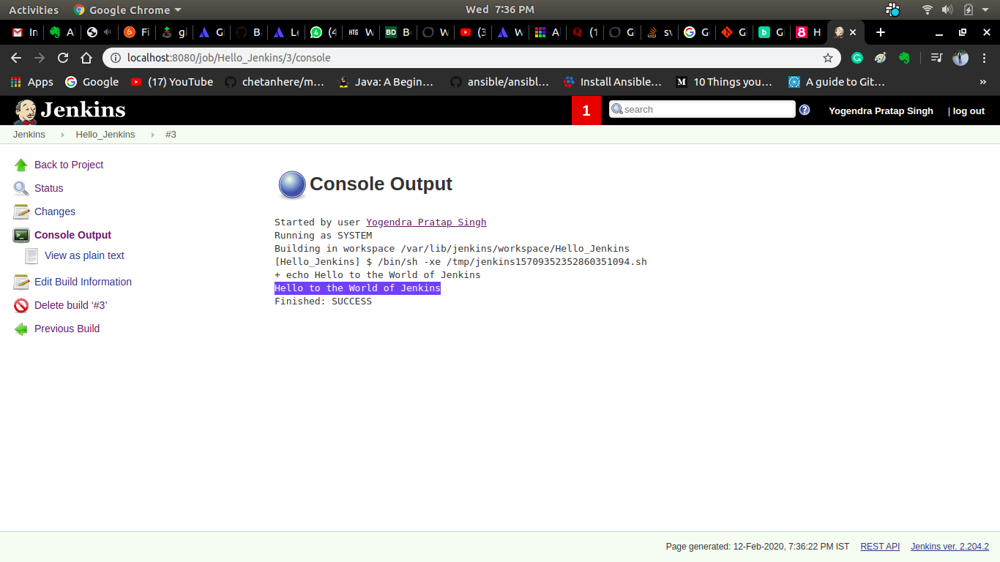
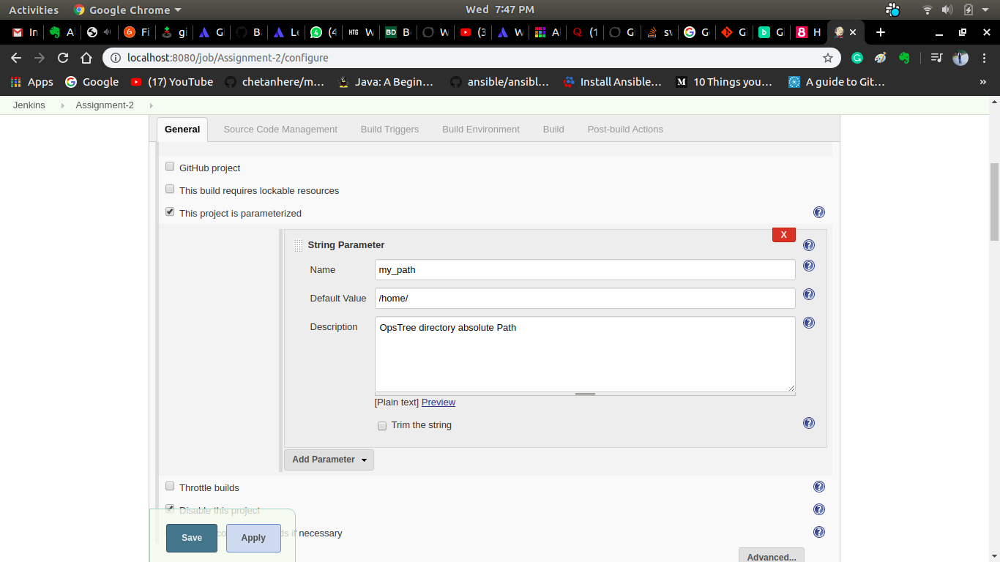
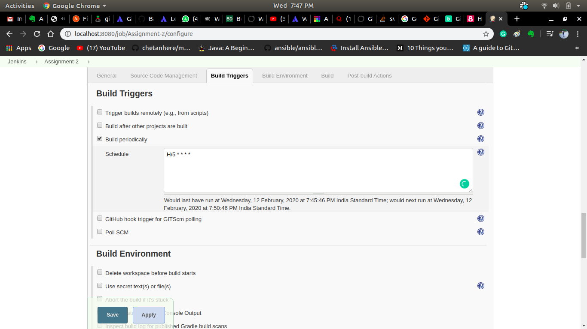
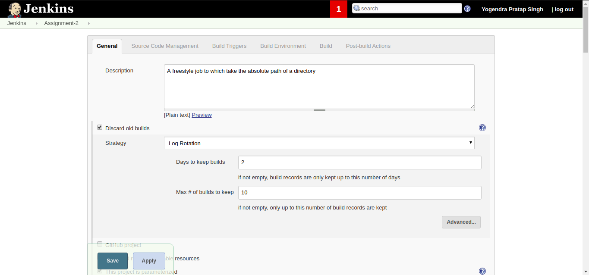

# build-and-release
## Jenkins Assignment-2 ##

**Create a freestyle job to print "Hello world".**

**Create a freestyle job to which take absolute path of a directory, List all files and directories inside that and take all the possible scenerios into consideration Also, setup email notification for each job failure only.**

For this I create a job and set THIS PROJECT IS PARAMETERIZED of STRING PARAMETER
on the Single Parameter set the name and Default value along. In default value we have to give the path where want to list our directory. Here I gives /home/

Here  I set trigger of every 5minutes after every 5minutes our build will run.

Set Post-build Action to send e-mail in given e-mail id.

**Update the previously created freestyle job to only retain last 10 build history but not beyond 2 days.**

For this I check the plugin named Discard old builds and make 2 days to keep buils and max 10 builds to keep.

**Clone the code available in the same repository.**
*  Using git protocol
*  Using ssh protocol
*  Using http protocol

