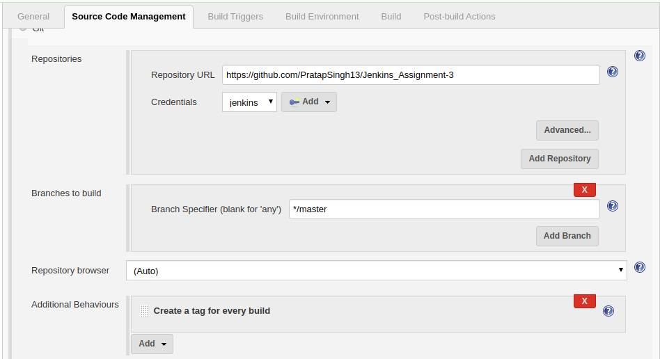
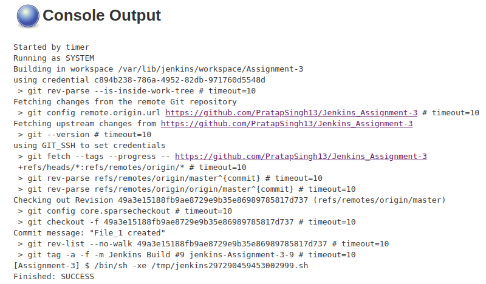
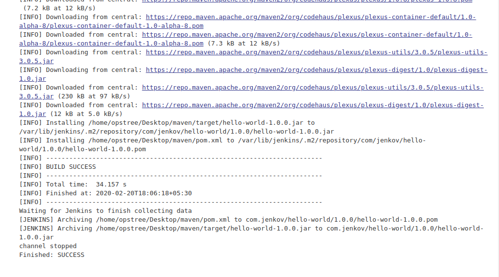
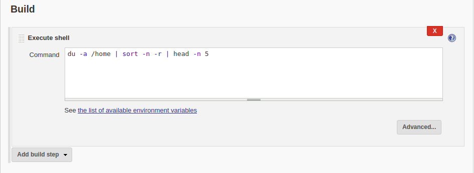
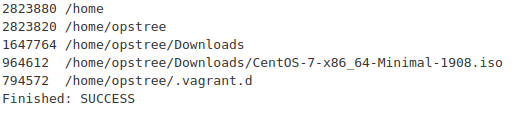

# Jenkins Assignment-3 #
**Create a Jenkins job that will create a tag using Git plugin**

Git-->Additional Behaviour-->Add Build for each Build

## Output ##

**Create a maven based jenkins job to build the code available in same repository**

**Run a script to find out top 5 files as major contributor to disk space**

For this I go on Build and execute shell in which put command of top 5 major contributors on disk space

**Create a Jenkins job that will generate a HTML file for the commits happened in last 10 days and publishes it as HTML report**

First I need to install plugin i.e. HTML publish

