# build-and-release
## Jenkins Assignment-5 ##

**Create a Jenkins job that should send an EmailAlert on every execution**

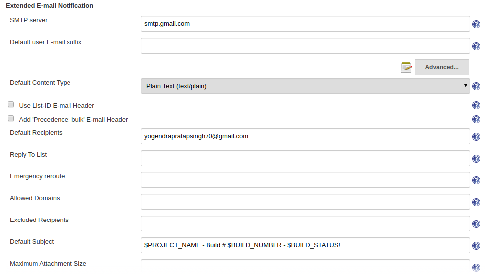

For this we can create Editable Email Notification on Post Build Action and provide the required details which is given on like Project From.......
We need to attach build log as **Attach Build Log**
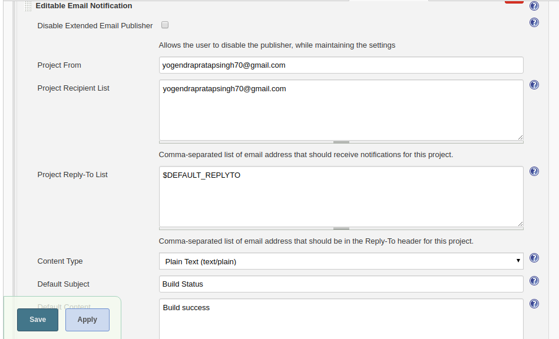

## Output ##

**Modify above Jenkins job to send notification only in case of state change i.e when it fails for first time, or succeed after failure**

For sending notification when it fails we need to add trigger as **Failure-1st** in Advanced Setting  
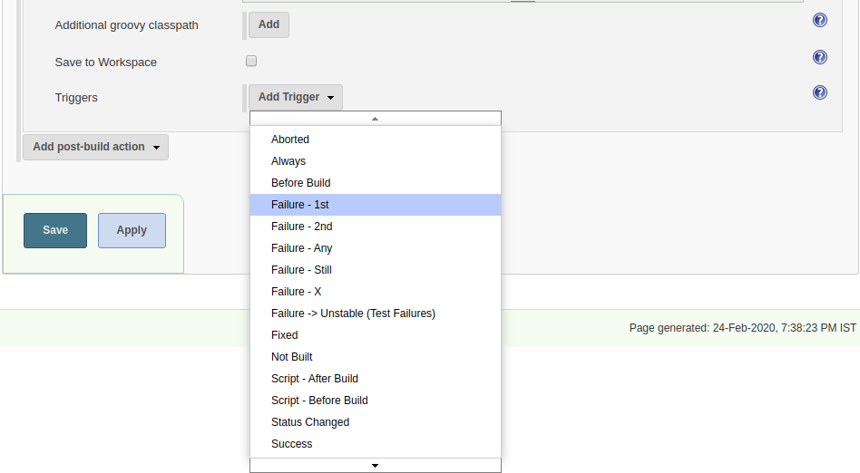

For sending notification when **succeed after failure** we need to add trigger as **Unstable (Test Failures)/failure->Success** in Advanced Setting

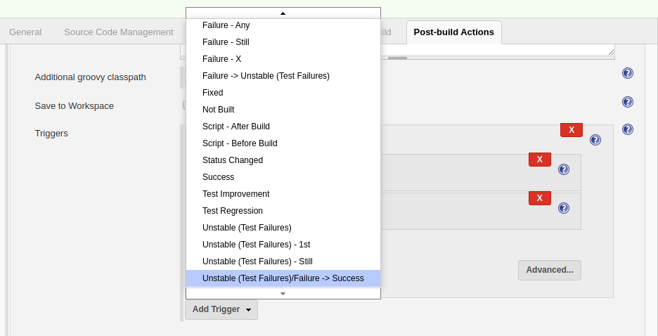

## Output ##

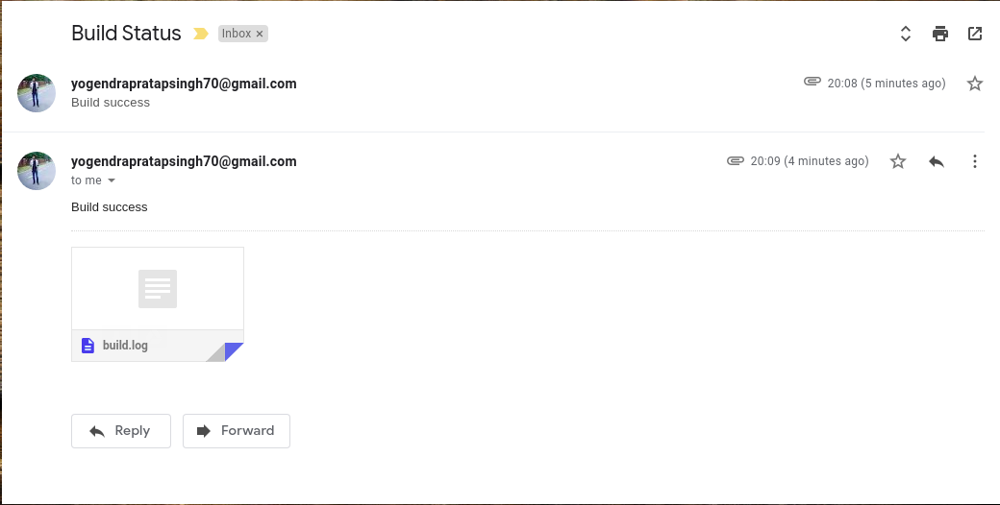

**Modify above Jenkins job to send console output as an attachment**

For this we need to **Attach Build Log** in Attach build log option.
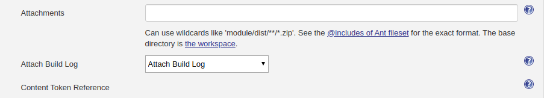

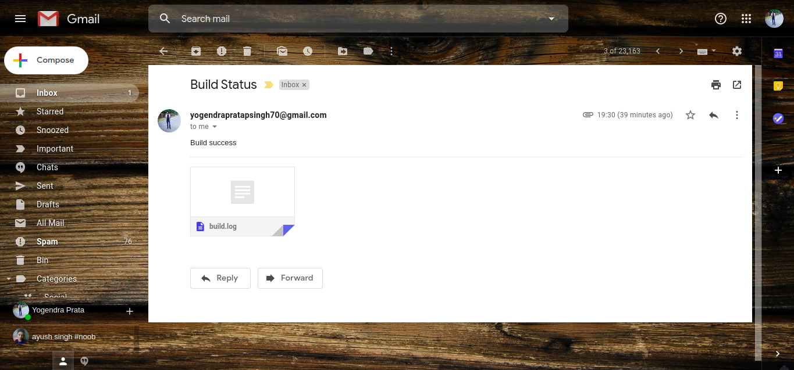

**Modify above Jenkins job to add console output as mail body instead of attachment**

For this we need to make Attach build log as **Do not Attach Build Log** 

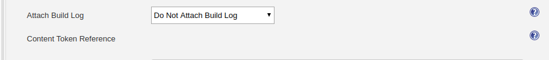

**Create a Jenkins job (ManageUser) that will take a user name as input and create it in local system**
For this we need to make our job as **This Project is Parametrized** in **General** section on that we need to choose **String Parameter** on that fillthe credential Such as Name, Description.....

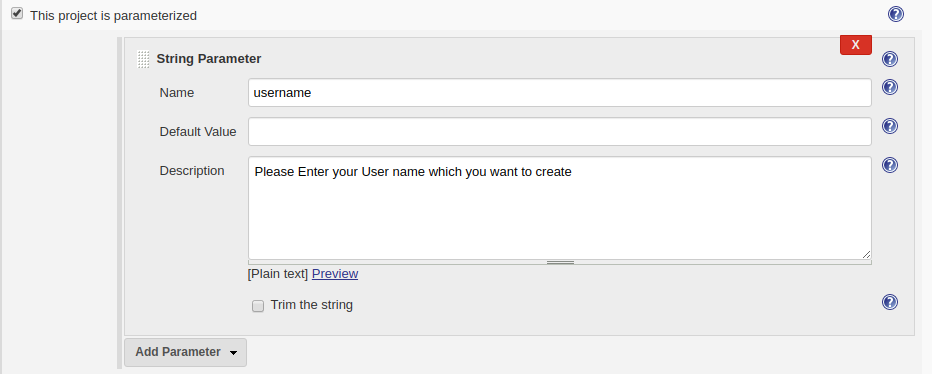

Next we need to choose **Execute Shell** in **Build** section and use command to create user i.e. **$ sudo useradd -m $username**
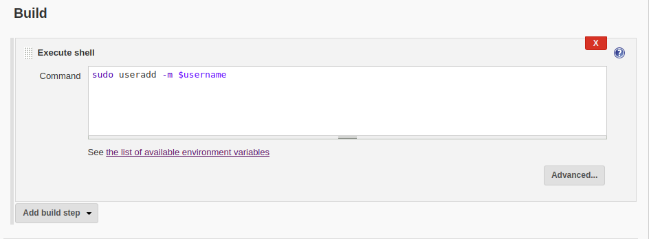

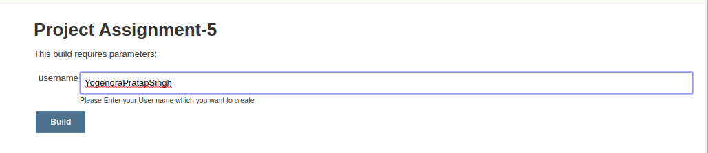

## Output ##
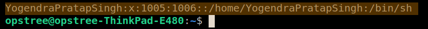

**Modify ManageUser jenkins job to take remote system IP as input to create the user**
For this we need to install plugin i.e. **Publish over SSH** after insstalling the plugin we have to configure pluggin in **Manage Jenkins--->Configure System** in this we need to put Jenkins User private SSH key and put the path of that private key in required block.
In Advance we need to set SSH Server on that put the Hostname IP and Username 

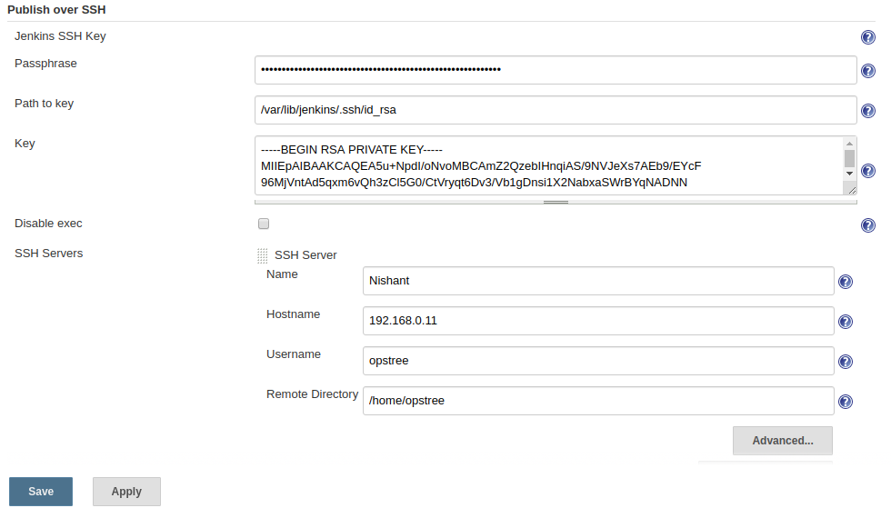

In General section build this Project is Parametrized (String Parameter) 

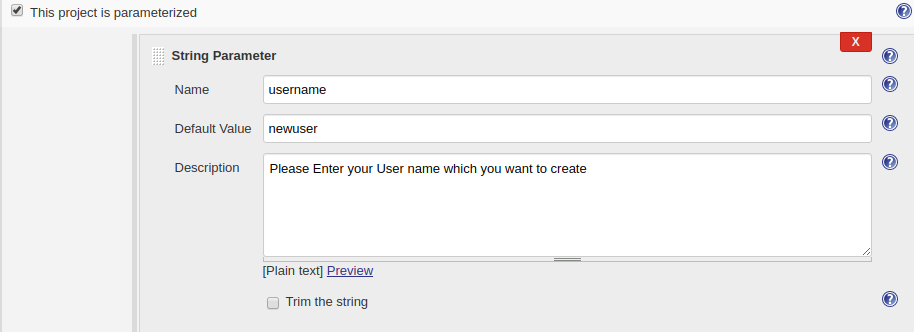

In Build Environment **Send files or execute commands over SSH before the build starts** in which we put the useradd command in **Exec Command**

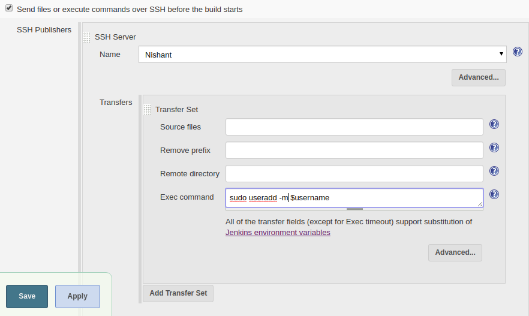

Now enter the User_Name which you want if you don't do so then it will automatically create user named **newuser**

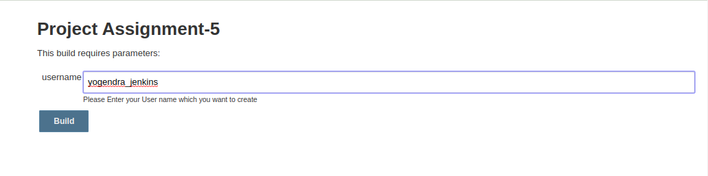

## Console Output ##
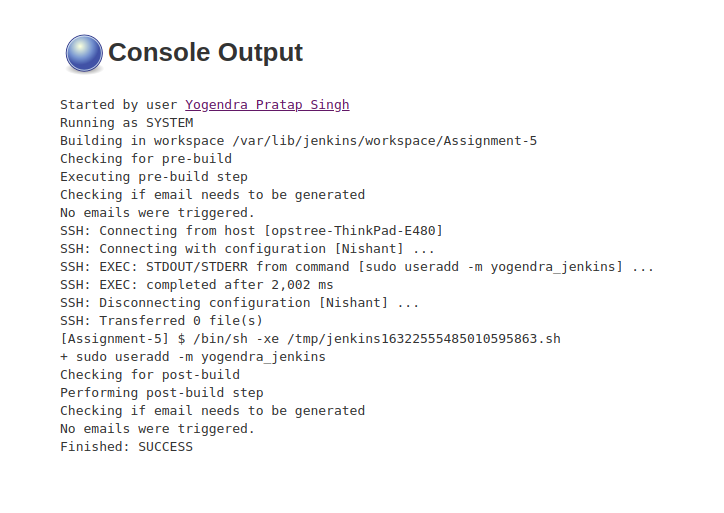

## Output ##

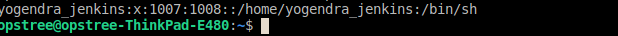

**Modify ManageUser jenkins job to take additional parameters for remote system to be managed such as**
* Username
* Home
* Shell

For this task we need create Parametrized Job named **String Parameter** one for username and one for shell  
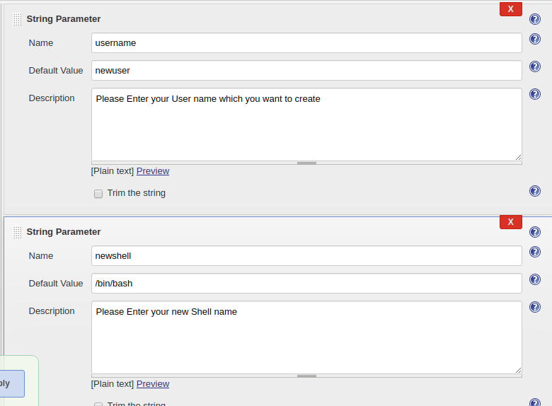

In the Build Environment check **Send files or execute commands over SSH before the build starts** and put **Exec Command** to run script aka we can
say command.

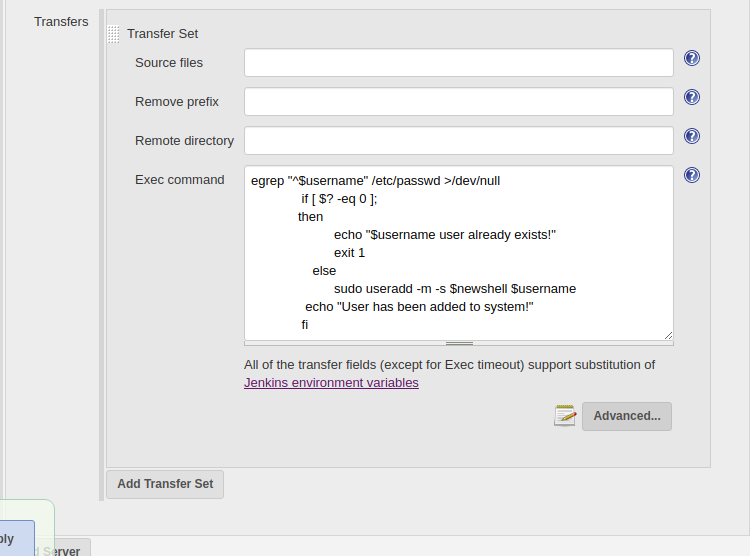

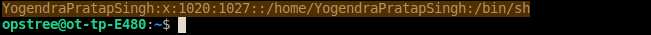
