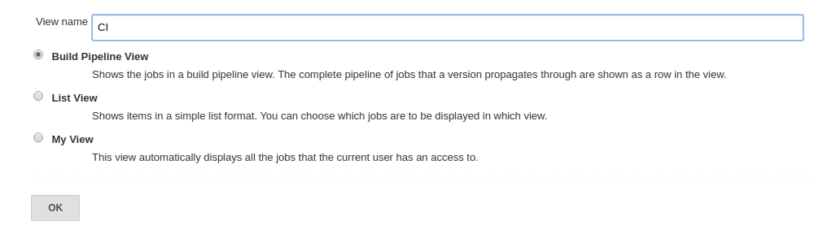
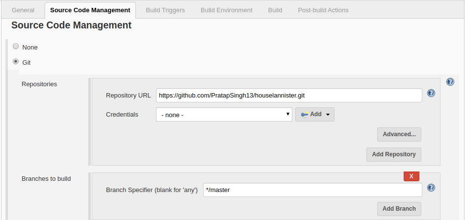
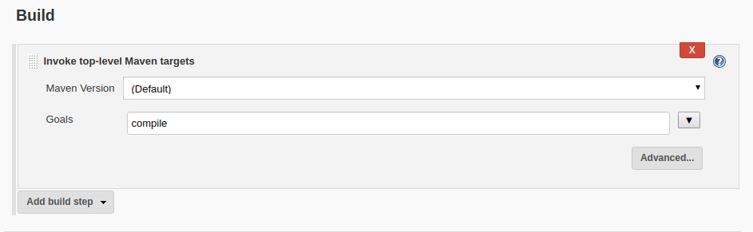
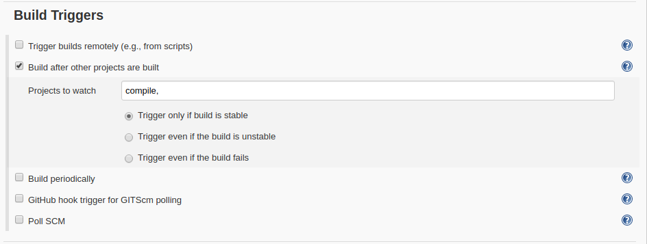
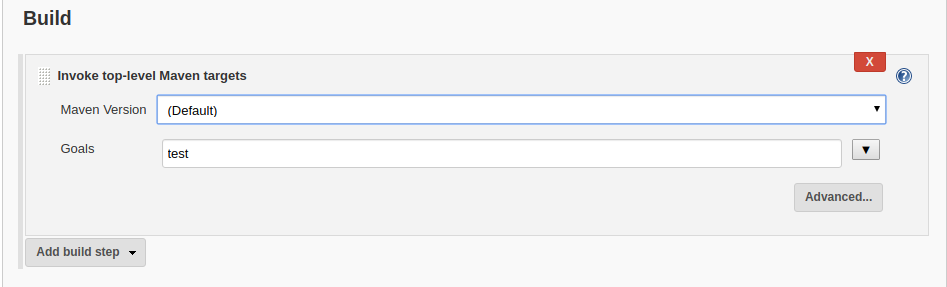

# Jenkins Assignment-9 #

**Assignment-9.1**

**Create a scripted pipeline that will containe different stages of a CI/CD pipeline. Include all CI and CD jobs.**
For this we can **Build Pipeline View** as named **CI** and after this we need to configure **Pipeline flow** our CI build on this I make first
 **Compile** 

After that we need to create Job for which I named **Compile** and on that we need to make scm over the Git from their Jenkins will get the repository

On Build section make **Invoke top level Maven Projects** and put **compile** on Goal.

After this we have to create a new Job for test on this we can Build triggers on this **Build after other projects are built** on this I take after 
compile.

Then we need to build our job as test in **Build** section

**Output**

